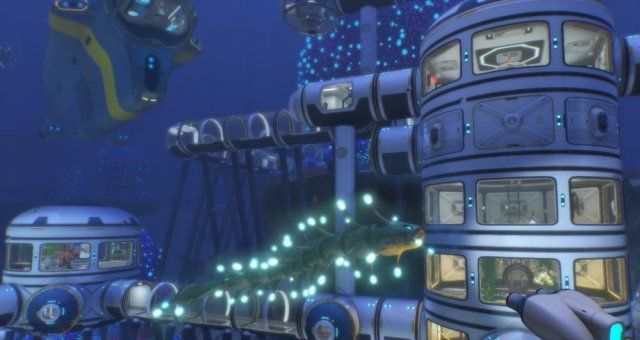
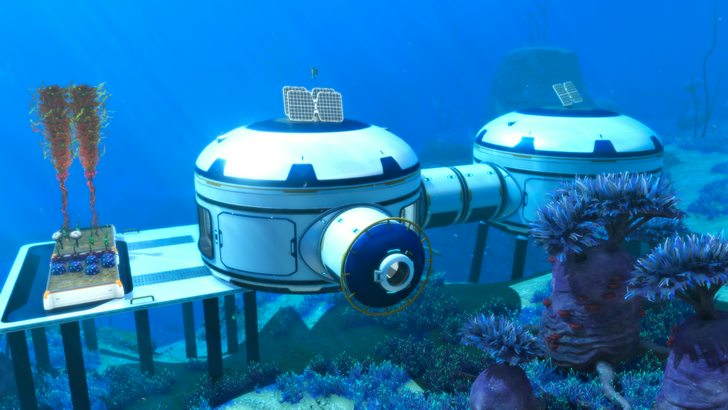
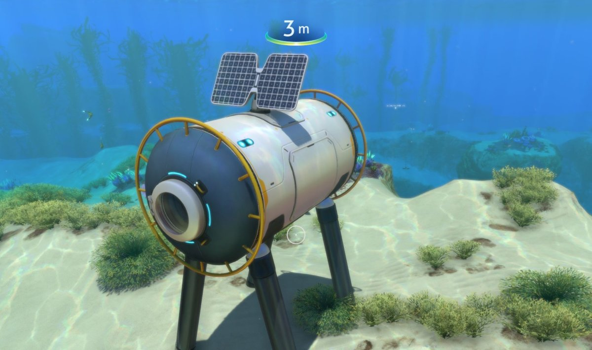
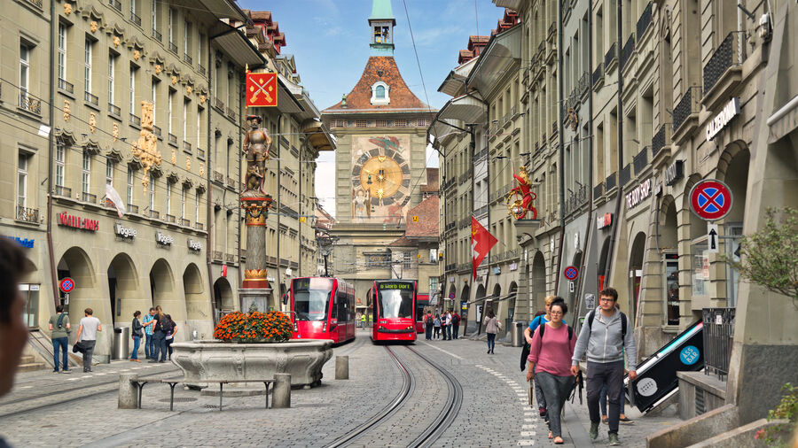
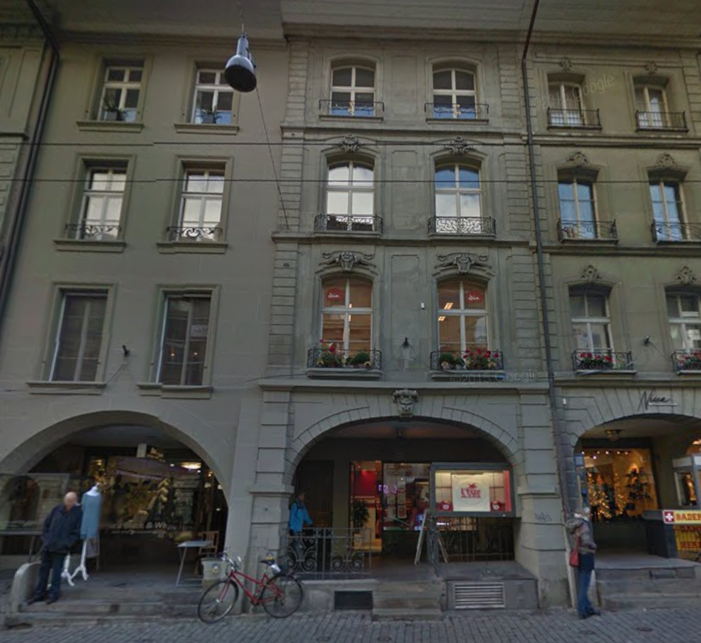
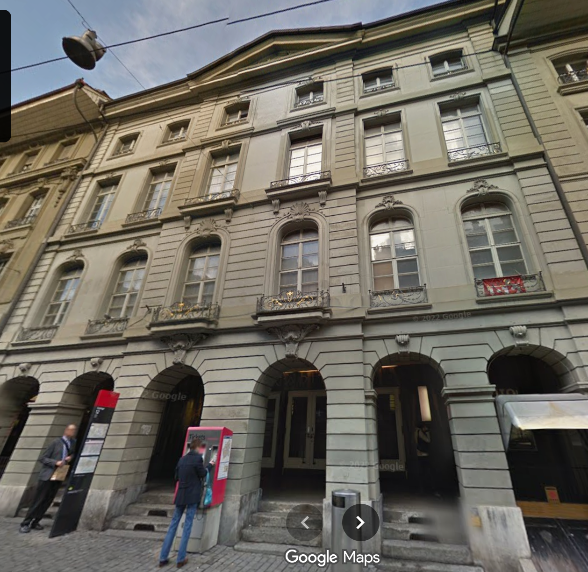

# Procedural Building Generation

## Submission 1

Due to time reasons, the current submission just includes a basic building tool that resembles the tutorial.

## Target Visual Style

### Option 1: Subnautica Bases

Futuristic underwater buildings that are made out of mainly curved and round components.

These bases are made out of mainly 2 types of components: Round large rooms and cylindrical tubes, the tubes come in standard I-variants, curved L-variants, as well as T and + shapes. the rooms have 6 sides connections that can either act as connections or have a window / reinforcement plane attached to them.

Main assets are the two type of base rooms (tube/large room)
windows / reinforcement planes / entrance (hatch)
There are usually yellow handrails around the building,
and also long pilalrs that connect the components to the surrounding terrain.

### Option 2: Old city of Bern

Medival Sandstone Buildings, with well decorated windows, archways, they usually have a triangular roof and distinct base that often includes an entrance to the basement.

These buildings have a variety of differently shaped but well layed out windows, almost all of them include a very tiny balcony overhang.

The base floor is usually a roofed walkway with archways that you can access by going up a few stairsteps from the main street, next to that staircase is usually another staircase that leads to the basement.

# Next.. Implementation...